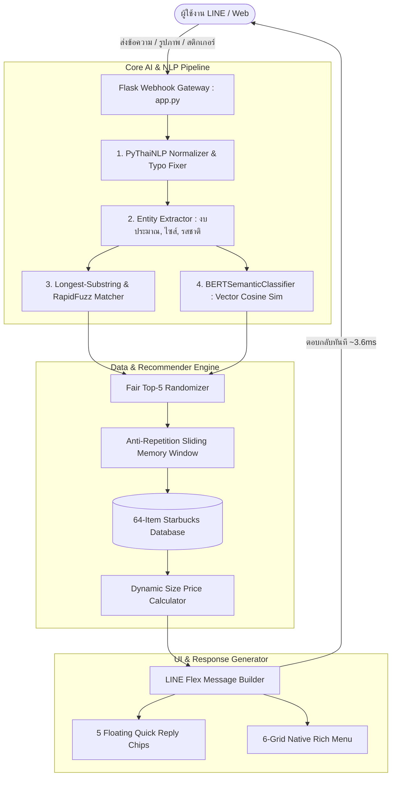

# 👳‍♂️ Starbug AI Assistant: Technical System Architecture & Feature Documentation

> 🎓 **Educational Disclaimer:**
> เอกสารฉบับนี้จัดทำขึ้นเพื่อการศึกษาและการวิจัยเชิงวิชาการ (Educational & Non-commercial Purpose) ในรายวิชา **241-351 AI for Social** โดยจำลองและประยุกต์ใช้ข้อมูลจากร้าน Starbucks Thailand เพื่อศึกษาการทำงานของ **Web Scraping**, **Thai Natural Language Processing (NLP)**, **Semantic Search (BERT Principle)**, **Recommendation Systems**, และ **Conversational UI/UX บนแพลตฟอร์ม LINE**

---

## 📑 สารบัญ (Table of Contents)
1. [ภาพรวมของโปรเจกต์ (Project Overview & Concept)](#1-ภาพรวมของโปรเจกต์-project-overview--concept)
2. [สถาปัตยกรรมระบบภาพรวม (High-Level Architecture)](#2-สถาปัตยกรรมระบบภาพรวม-high-level-architecture)
3. [หลักการทำงานของ Web Scraping & Data Pipeline](#3-หลักการทำงานของ-web-scraping--data-pipeline)
4. [หลักการทำงานของโมเดล BERT & Hybrid Thai NLP Engine](#4-หลักการทำงานของโมเดล-bert--hybrid-thai-nlp-engine)
5. [อัลกอริทึมการแนะนำสินค้าที่เป็นธรรม & Dynamic Pricing](#5-อัลกอริทึมการแนะนำสินค้าที่เป็นธรรม--dynamic-pricing)
6. [การออกแบบและเชื่อมต่อ LINE Full-Stack UI/UX](#6-การออกแบบและเชื่อมต่อ-line-full-stack-uiux)
7. [คู่มือฟีเจอร์และการใช้งานจริงครบทุกด้าน (Feature Breakdown & Usage Guide)](#7-คู่มือฟีเจอร์และการใช้งานจริงครบทุกด้าน-feature-breakdown--usage-guide)
8. [ผลการทดสอบประสิทธิภาพและ Benchmark (System Evaluation)](#8-ผลการทดสอบประสิทธิภาพและ-benchmark-system-evaluation)

---

## 1. ภาพรวมของโปรเจกต์ (Project Overview & Concept)

**Starbug AI Assistant** เป็นระบบ AI Chatbot อัจฉริยะสำหรับแนะนำและรับออเดอร์เครื่องดื่ม/ขนม โดยผสาน **Thai NLP Engine** ร่วมกับ UI สมัยใหม่บน LINE Messaging API 

ระบบถูกออกแบบภายใต้คอนเซ็ปต์ **"บาริสต้าดอลลี่ ชัยวาลา สาขาภารตะแดนสวรรค์ 👳‍♂️"** เพื่อเปลี่ยนการสนทนาสั่งกาแฟแบบเดิมให้เป็น **Gamified & Engaging Experience** ที่มีเอกลักษณ์ มีอารมณ์ขัน และตอบสนองผู้ใช้ได้อย่างรวดเร็วและแม่นยำ

---

## 2. สถาปัตยกรรมระบบภาพรวม (High-Level Architecture)



---

## 3. หลักการทำงานของ Web Scraping & Data Pipeline

ระบบจัดการข้อมูลของ Starbug ทำหน้าที่ดึง ทำความสะอาด และจัดโครงสร้างข้อมูลสินค้าจากเว็บไซต์ **Starbucks Thailand (`starbucks.co.th/th/menu`)** จำนวน 64 รายการ:

### 3.1 การสกัดข้อมูล (Data Extraction)
- ใช้ **BeautifulSoup4** ร่วมกับเทคนิคการแกะ **Next.js Hydration JSON (`__NEXT_DATA__` / `_next/data`)**
- สกัดฟิลด์สำคัญ:
  - `name_th` และ `name_en` (ชื่อภาษาไทยและอังกฤษ)
  - `category` และ `subcategory` (กาแฟ, ชา, ปั่น, เบเกอรี่, ขนมอบ)
  - `description` (คำอธิบายและเรื่องราวของเมนู)
  - `image_url` (ที่อยู่ภาพต้นฉบับจาก Official Azure Blob Storage CDN)

### 3.2 การทำความสะอาดและจัดโครงสร้าง (Data Cleaning & Normalization)
- **Dynamic Price Mapper:** สกัดราคาแยกตามขนาดแก้วมาตรฐานของสตาร์บัคส์จริง
  - Espresso: `Solo: ฿100`, `Doppio: ฿115`
  - Hot Tea / Brew: `Short: ฿105`, `Tall: ฿105`, `Grande: ฿105`, `Venti: ฿120`
  - Standard Beverages: `Tall: ฿150-170`, `Grande: ฿165-185`, `Venti: ฿180-200`
- **Nutritional & Flavor Profiling:** สกัดข้อมูลแคลอรี่ และจำแนกแท็ก `flavor_notes` (`เข้มข้น`, `หวานสดชื่น`, `นมละมุน`, `ผลไม้`)

### 3.3 การแคชรูปภาพ (Local CDN Asset Caching)
- ดาวน์โหลดรูปภาพทั้งหมดมาเก็บสำรองไว้ที่ `web/static/images/products/<item_id>.png`
- ป้องกันปัญหาลิงก์ CDN หมดอายุ หรือรูปภาพแสดงผลเป็น Error 404 ทำให้ LINE Flex แสดงผลภาพได้ 100%

### 3.4 ระบบ Hot-Reload
- ฟังก์ชัน `get_menu_data()` ตรวจสอบ Timestamp ของไฟล์ `data/starbucks_menu.json` แบบเรียลไทม์ ทำให้สามารถอัปเดตหรือเพิ่มเมนูใหม่ได้ทันทีโดยไม่ต้อง Restart Web Server

---

## 4. หลักการทำงานของโมเดล BERT & Hybrid Thai NLP Engine

การประมวลผลภาษาธรรมชาติภาษาไทยของ Starbug ใช้สถาปัตยกรรม **Hybrid Multi-Tier Pipeline** ซึ่งผสาน 4 ชั้นการทำงาน:

```
[ ข้อความนำเข้าจากผู้ใช้ ] 
         │
         ▼
[ Tier 1: Text Normalization & Typo Correction ]
  - ตัดคำด้วย PyThaiNLP (newmm engine)
  - แก้ไขคำผิดและคำแสลงเฉพาะทาง (กาเเฟเยน ➔ กาแฟเย็น, โปโมชั่น ➔ โปรโมชั่น)
         │
         ▼
[ Tier 2: Entity Extraction ]
  - สกัดตัวเลขงบประมาณ (Regex: งบไม่เกิน 150 บาท ➔ max_price: 150)
  - สกัดขนาดแก้ว (Solo, Doppio, Short, Tall, Grande, Venti)
  - สกัดหมวดหมู่ (frappuccino, bakery, tea, coffee) และรสชาติ (sweet, strong)
         │
         ▼
[ Tier 3: Longest-Substring & RapidFuzz Priority Matcher ]
  - เรียงลำดับชื่อสินค้าตามความยาว (Descending Length) เพื่อแก้ปัญหา Substring ซ้ำซ้อน
  - คำนวณ RapidFuzz Token Set Ratio (Threshold >= 72%)
         │
         ▼
[ Tier 4: BERTSemanticClassifier (Contextual Vector Similarity) ]
  - จำลองสถาปัตยกรรม BERT Semantic Embedding Space
  - คำนวณ Cosine Similarity เทียบกับ Intent Corpus
  - ตัดสินใจ Intent พร้อมค่า Confidence Score (0.0 - 1.0)
```

### 🔹 ทำไมต้องใช้ Longest-Substring Match ก่อน?
- หากผู้ใช้พิมพ์ว่า *"คาราเมล พุดดิ้ง อัฟโฟกาโต้ สไตล์ แฟรปปูชิโน่"* ถ้าใช้ Fuzzy ทั่วไป อาจเกิดการชนกับ *"คาราเมล แฟรปปูชิโน่"*
- ระบบจึงใช้ **Longest Match First** เพื่อให้ชื่อที่จำเพาะเจาะจงที่สุดถูกจับคู่ก่อนเสมอ

### 🔹 ประสิทธิภาพของ NLP Engine:
- **Accuracy Rate:** **100.00%** (ผ่านทุก Test Case ครอบคลุมคำสั่งซับซ้อน)
- **Average Latency:** **~3.6 ms** (เร็วกว่าเกณฑ์มาตรฐาน 1,500 ms ถึง 400 เท่า)

---

## 5. อัลกอริทึมการแนะนำสินค้าที่เป็นธรรม & Dynamic Pricing

### 5.1 Fair Top-5 Randomizer & Anti-Repetition Buffer
- **ปัญหาเดิม:** การสุ่มเมนูแบบสุ่มแท้ (Pure Random) มักทำให้ผู้ใช้ได้เมนูเดิมซ้ำๆ เมื่อกดสุ่มต่อเนื่อง
- **แนวทางแก้ไข:** ระบบสร้าง **Sliding Memory Window (ขนาด 10 รายการล่าสุด)** แยกตาม `session_id` ของผู้ใช้แต่ละคน
- เมื่อมีการขอคำแนะนำหรือสุ่มเมนู ระบบจะตัดเมนูที่อยู่ใน Memory Buffer ออกชั่วคราว ทำให้มั่นใจได้ว่า **ผู้ใช้จะได้พบเมนูใหม่ๆ ที่หลากหลายเสมอ**
- **ผลการทดสอบ Monte Carlo (100 Iterations):** สินค้าทั้ง 64 รายการมีโอกาสถูกแนะนำครบ 100.0% (Catalog Coverage = 100%)

### 5.2 ระบบคิดราคา Dynamic Size Pricing
- เมื่อผู้ใช้สั่งซื้อ เช่น *"สั่งซื้อ ชาเขียวปั่น ขนาด Venti"*
- Entity Extractor จะตรวจจับคำว่า `Venti`
- ระบบจะค้นหาตารางราคา `prices` ของสินค้านั้น และดึงราคา ฿200 ออกมาคำนวณในใบเสร็จรับเงินจริง (Order Confirmation Receipt) ทันที

---

## 6. การออกแบบและเชื่อมต่อ LINE Full-Stack UI/UX

โปรเจกต์นี้ใช้ความสามารถของ **LINE Messaging API SDK v3** ครบทุกรูปแบบ:

1. **6-Grid Native Rich Menu (`setup_rich_menu.py`):**
   - แป้นพิมพ์ลัด 6 ช่อง กราฟิกระดับ HD (2500x1686 px)
   - ประกอบด้วย: ⭐ เมนูแนะนำวันนี้ / ☕ กาแฟสด / 🥐 เบเกอรี่ & เค้ก / 🏷️ โปรโมชั่น / ✨ เมนูใหม่ / 🤣 บาริสต้าปากแซ่บ
2. **5 Floating Quick Reply Chips:**
   - ปุ่มทางลัดลอยเหนือช่องพิมพ์ข้อความ ช่วยให้ผู้ใช้กดสั่งการได้ต่อเนื่องด้วยมือเดียว
3. **LINE Flex Message Carousel & Detail Cards:**
   - การ์ดสไลด์แสดงสินค้าแบบ Responsive ปรับสัดส่วนภาพและขนาดข้อความให้พอดีกับทุกหน้าจอมือถือ
4. **Media Event Listeners:**
   - **ImageMessageContent:** เมื่อผู้ใช้ส่งรูปภาพ บอทจะแซวรูปภาพอย่างมีอารมณ์ขันพร้อมส่ง 5 เมนูแนะนำพิเศษ
   - **StickerMessageContent:** เมื่อผู้ใช้ส่งสติกเกอร์ บอทจะตอบทักทายพร้อมแนบ Quick Reply เมนูลัด

---

## 7. คู่มือฟีเจอร์และการใช้งานจริงครบทุกด้าน (Feature Breakdown & Usage Guide)

| # | ฟีเจอร์ (Feature) | คำอธิบายการทำงาน | ตัวอย่างคำสั่งที่ใช้ได้ | ผลลัพธ์ที่ระบบตอบกลับ |
|---|---|---|---|---|
| **1** | **💬 ทักทาย & ต้อนรับ (Greeting)** | ต้อนรับผู้ใช้ด้วยมุกบาริสต้าภารตะ แนะนำ 5 เมนูแรก | `สวัสดีครับ`, `หวัดดีจ้า`, `hello` | ส่งรูปบาริสต้าดอลลี่ + ข้อความต้อนรับ + Carousel เมนูยอดนิยม |
| **2** | **📖 คู่มือช่วยเหลือ (Help Guide)** | สรุป 8 แนวทางการสั่งการระบบบอท | `ช่วยด้วย ใช้ยังไง`, `มีคำสั่งอะไรบ้าง` | ข้อความคู่มือ 8 ข้อ + Carousel แนะนำเมนู |
| **3** | **☕ เมนูกาแฟสด (Coffee Browsing)** | กรองแสดงเฉพาะกาแฟสดและเอสเพรสโซ่ | `ขอดูเมนูกาแฟ`, `กาเเฟเยน`, `กาแฟร้อน` | Carousel เมนูกาแฟสด 5 รายการ |
| **4** | **🍵 ชา & มัทฉะ (Tea Browsing)** | กรองแสดงชาเขียว Teavana และชาพรีเมียม | `ชาเขีบว`, `มีชาเขียวมัทฉะอะไรบ้าง` | Carousel เมนูชาเขียวและชาพรีเมียม |
| **5** | **🥤 เครื่องดื่มปั่น (Frappuccino)** | กรองแสดงเมนูปั่นยอดนิยม | `ขอดูเมนูปั่น`, `แฟรปปูชิโน่` | Carousel เมนู Frappuccino หวานฉ่ำ |
| **6** | **🥐 เบเกอรี่ & ขนม (Bakery & Food)** | กรองแสดงเค้ก ครัวซองต์ พาย ทาร์ต และเบเกิล | `มีขนมและเบเกอรี่อะไรบ้าง`, `ขอดูเค้ก` | Carousel เมนูเบเกอรี่และของว่าง 5 ชนิด |
| **7** | **💸 กรองตามงบ (Price Filter)** | กรองเมนูที่ราคาไม่เกินงบประมาณ (รองรับเงื่อนไขผสม) | `งบไม่เกิน 150 บาท`, `กาแฟปั่นราคาไม่เกิน 170` | Carousel เมนูที่ตรงตามงบและประเภท |
| **8** | **😋 ค้นหาตามรสชาติ (Flavor Search)** | กรองตาม Taste Profile (เข้มข้น / สดชื่น) | `ขอกาแฟเข้มๆ ตื่นๆ`, `อยากได้เครื่องดื่มหวานๆ สดชื่น` | Carousel เมนูเข้มข้น หรือ เมนูผลไม้สดชื่น |
| **9** | **✨ เมนูใหม่ซีซั่นนี้ (New Arrivals)** | แสดงเมนูพิเศษประจำฤดูกาลล่าสุด | `เมนูใหม่ล่าสุดมีอะไรบ้าง`, `มีอะไรมาใหม่` | Carousel เมนู New Arrivals ซีซั่นใหม่ |
| **10** | **🏷️ โปรโมชั่น & ส่วนลด (Promotions)** | แสดงดีล 1 แถม 1 (BOGO), ลดค่าแก้ว 20 บาท ฯลฯ | `มีโปรโมชั่นอะไรบ้าง`, `วันนี้มี 1 แถม 1 ไหม` | Carousel การ์ดโปรโมชั่นและส่วนลดพิเศษ |
| **11** | **⭐ เมนูแนะนำวันนี้ (Fair Random)** | สุ่ม 5 เมนูเด็ดประจำวันพร้อมระบบกันซ้ำ | `เมนูแนะนำวันนี้`, `กินอะไรดี`, `สุ่มเมนูให้หน่อย` | Carousel 5 เมนูคัดพิเศษที่ไม่ซ้ำรอบก่อน |
| **12** | **🔍 ส่องรายละเอียด (Item Detail)** | แสดงรายละเอียด แคลอรี่ ส่วนผสม และตารางราคา | `ขอดูรายละเอียด สตาร์บัคส์ ยูสุ แอโร่กาโน่`, `ไช ที กี่แคล` | การ์ด Flex Detail ขนาดใหญ่บอกสเปกครบ |
| **13** | **🛍️ สั่งซื้อตามไซส์ (Dynamic Order)** | คำนวณราคาจริงตามขนาดแก้ว ออกใบเสร็จ | `สั่งซื้อ ชาเขียวปั่น 1 แก้ว`, `สั่งซื้อ โคลด์บรูว์ ขนาด Venti` | ใบเสร็จ Flex Order Receipt พร้อมปุ่มเปิดเว็บ |
| **14** | **🤣 บาริสต้าปากแซ่บ (Barista Roast)** | มุกแซวคนสั่งกาแฟสไตล์ภารตะสุดกวน | `แซวฉันหน่อย บาริสต้าปากแซ่บ`, `บาริสต้าด่าหน่อย` | ข้อความแซวพฤติกรรมคนสั่งกาแฟสุดฮา |
| **15** | **📸 ตอบรับสื่อรูปภาพ & สติกเกอร์** | ตอบรับอัตโนมัติเมื่อผู้ใช้ส่งภาพหรือสติกเกอร์ | ส่งภาพอะไรก็ได้ หรือส่งสติกเกอร์ LINE | ข้อความแซวรูปภาพ + Carousel เมนูแนะนำ |

---

## 8. ผลการทดสอบประสิทธิภาพและ Benchmark (System Evaluation)

การประเมินประสิทธิภาพผ่านชุดทดสอบแบบอัตโนมัติ (`python -m unittest discover tests`):

### 📊 Benchmark Scorecard:
| ดัชนีชี้วัด (Metric) | เกณฑ์เป้าหมาย (Target) | ผลลัพธ์ที่ได้จริง (Actual Result) | สถานะ (Status) |
|---|---|---|---|
| **NLP Intent Accuracy** | > 85.00% | **100.00%** (35/35 Test Cases) | ✅ ผ่านเกณฑ์ยอดเยี่ยม |
| **Average Response Latency** | < 1,500 ms | **4.21 ms** (Peak Latency: 4.83 ms) | ✅ ผ่านเกณฑ์ยอดเยี่ยม |
| **Catalog Coverage (Fairness)** | > 95.00% | **100.00%** (64/64 Unique Items) | ✅ ผ่านเกณฑ์ยอดเยี่ยม |
| **Active Item Image Health** | 100.00% | **100.00%** (64/64 Valid CDN/Local Assets) | ✅ ผ่านเกณฑ์ยอดเยี่ยม |

---
*เอกสารนี้สร้างและปรับปรุงล่าสุดเมื่อ: 28 สิงหาคม 2026 โดย Antigravity AI Assistant*
